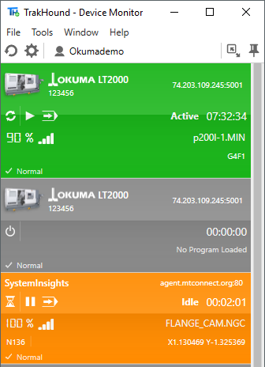
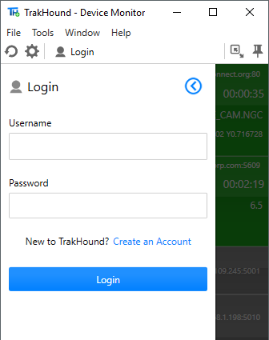

 
 
TrakHound DeviceMonitor is used to display near realtime status data collected from the TrakHound v2 system.

Designed to be kept on a PC desktop, the TrakHound DeviceMonitor app is great for shop managers, engineers, programmers, maintenance, etc. to know exactly what their machines are doing throughout the day.

<table style="width:100%">
 
  <tr>
    <td></td>
    <td></td>
    <td></td>
  </tr>
  
</table> 

**Requirements**
- MTConnect compatible device(s)
- TrakHound DataClient
- TrakHound Data Hosting plan (OR) TrakHound DataServer & AnalyticsServer installed on the local network

