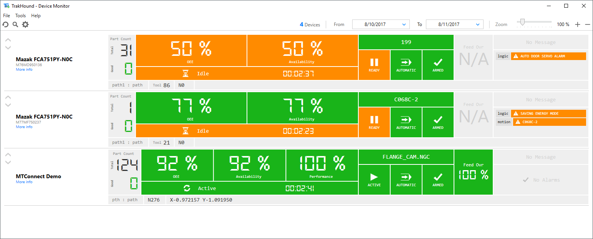
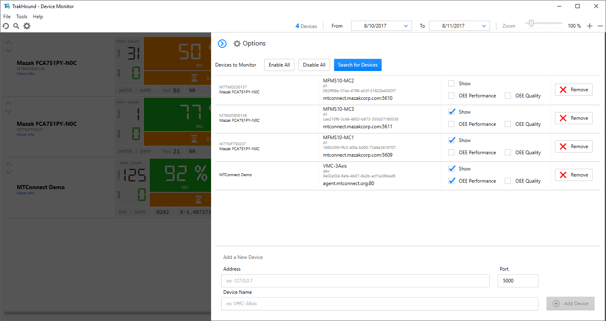
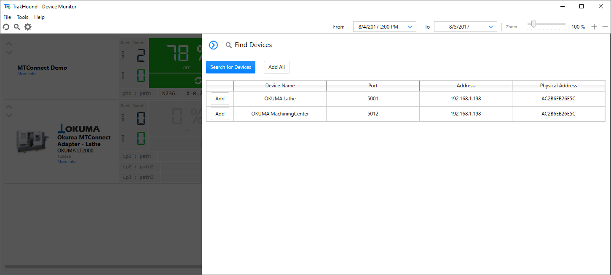

 
 
TrakHound DeviceMonitor is a fully standalone dashboard for viewing MTConnect data from industrial CNC equipment.

Get started with IIoT by running the TrakHound DeviceMonitor dashboard to view a rolling 24 hour window of realtime data from your equipment.

- Easy installation
- No databases to setup
- Automatically find MTConnect compatible devices on your network
- Easy to read dashboard
- View OEE and part count for the past 24 hours

**Requirements**
- MTConnect compatible device(s)
- Microsoft .NET 4.0 or newer

